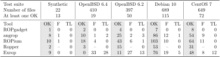

# ROP Benchmark

This repository contains tests for benchmarking ROP compilers. ROP Benchmark is
intended to compare ROP compilers. ROP Benchmark was used to evaluate
existing open source tools in ["Survey of methods for automated code-reuse
exploit generation"](https://www.ispras.ru/preprints/docs/prep_32_2019.pdf) paper.

# Installation

## Prerequisites

    binutils gcc gcc-multilib nasm make docker

### Ubuntu 18.04

    $ sudo apt install build-essential nasm gcc-multilib
    $ sudo snap install docker

## Running environment

ROP Benchmark is supposed to run in docker container. It provides configured
environment with all tools installed and `/bin/sh` replaced by script reporting
success status of ROP chain execution.

Dockerfile is placed inside `docker` folder. To build docker image:

    $ cd docker
    $ sudo docker build -t rop-benchmark .

# Usage

Entry point to run benchmark is `run.sh` script.

    $ ./run.sh --help

		usage: run.py [-h] [-s] [-t TOOL] [-r REAL_LIFE] [-n CORES] [-a ARCH] [-c]
		              [-g] [-b BINARY] [--timeout TIMEOUT] [--clean]
		
		Rop-benchmark entry point. By default it runs all tests.
		
		optional arguments:
		  -h, --help            show this help message and exit
		  -s, --synthetic       Run only synthetic test-suite
		  -t TOOL, --tool TOOL  Run only tool
		  -r REAL_LIFE, --real-life REAL_LIFE
		                        Run only specified real life binary test-suite.
		  -n CORES, --cores CORES
		                        The number of parallel instances to run.
		  -a ARCH, --arch ARCH  The target architecture of framework.
		  -c, --check-only      Only check chains generated previously
		  -g, --generate-only   Only generate chains. Do not try to run and check
		                        them.
		  -b BINARY, --binary BINARY
		                        Run particular binary e.g. openbsd-62/ac.bin
		  --timeout TIMEOUT     The timeout in seconds for each binary
		  --clean               Clean rop-benchmark working tree from any artifacts of
		                        previous runs

# Bash to Docker

    $ sudo ./bash.sh

# Benchmark structure

## Payload type

There are many different types of ROP chain payloads. At the moment we test only
one type of payload - system call of `execve` to `"/bin/sh"`. It is most general
type of payload supported by all tools.

## Target binaries

The benchmark provides target binaries for ROP compilers. These binaries supply
two things: exploitable vulnerability and a set of ROP gadgets. A set of ROP
gadgets can be of two different types: synthetically created or just taken from
real life binaries. To use both of them we created the simple vulnerable program
`vul.c` which reads an input file into the buffer placed on the stack (without
boundary checking, of course). Then we compiled this program and inserted each
target binary as code section inside a separate ELF file. So we get exploitable
vulnerability and target binary code all together in one address space.

### Synthetic test suite

Synthetic tests are written in `nasm` and placed in `binaries/x86/synthetic/source`
directory. Every file contains a small set of ROP gadgets and checks the ability
to chain particular combination of gadgets.

To run only synthetic tests:

    $ ./run.sh -s

### Real life binaries test suite

Real life binaries are placed in `binaries/x86/reallife/orig`. It contains several
set of binaries from different Linux distributions:

1. CentOS 7.1810
2. Debian 10 cloud
3. OpenBSD 6.2
4. OpenBSD 6.4

It is just almost all ELF files (both binaries and shared libraries) of default
installation.

To run only real life set of binaries, e.g. openbsd-62:

    $ ./run.sh -r openbsd-62

Note: we tested binaries both of OpenBSD 6.2 and OpenBSD 6.4 because their
developers intentionally try to reduce the amount of ROP gadgets.

## Supported tools

There are many tools to automatically create ROP chains. Supporting all of
them is not a easy task; so we pick these ones as most popular and easier to
support.

1. [ROPgadget](https://github.com/JonathanSalwan/ROPgadget)

2. [Ropper](https://github.com/sashs/ropper)

3. [ropium](https://github.com/Boyan-MILANOV/ropium)

4. [angrop](https://github.com/salls/angrop)

5. [exrop](https://github.com/d4em0n/exrop)

To run all tests only with e.g. ropper

    $ ./run.sh -t ropper

# Benchmark results

Benchmark print results in terminal like this:

    === Tool 'angrop' === Exp. type 'execve'
    1:rop-benchmark:angrop:binaries/x86/reallife/vuln/centos-7.1810/ld.bfd.bin - INFO - OK
    2:rop-benchmark:angrop:binaries/x86/reallife/vuln/centos-7.1810/ld.gold.bin - CRITICAL - FAIL TIMEOUT
    3:rop-benchmark:angrop:binaries/x86/reallife/vuln/centos-7.1810/libBrokenLocale-2.17.so.bin - ERROR - Compilation ERROR with 1 (angrop)
    4:rop-benchmark:angrop:binaries/x86/reallife/vuln/centos-7.1810/libasound.so.2.0.0.bin - CRITICAL - FAIL HIJACK
    --- Test suite --- binaries/x86/reallife/vuln/centos-7.1810 : 53 / 649 (passed/all)

There are 4 states of tests:

1. `ERROR` - tool didn't generate a ROP chain.
2. `FAIL TIMEOUT` (TL) -  tool exceeds the time limit (300 s as default).
3. `FAIL HIJACK` (F) - tool generated a ROP chain but it didn't run `/bin/sh`.
4. `OK` - tool generated a ROP chain and it ran `/bin/sh`.

## Evaluation

Each tool was run single-threaded with 1 hour time limit.



Note: Ropper almost always generates a ROP chain script file, so `FAIL HIJACK`s were not evaluated.
[results.pdf](results.pdf) contains a hyperlink for each tool repository with a specific commit hash.

# Auxiliary scripts

## table.py

Prints results table. Takes rop-benchmark output as input. `--latex` for LaTeX
table.

## common.py

The script helps to identify two things:

1. the common subset of binaries that are OK at least for one instrument,
2. the difference between the particular tool result and the common subset.

To print the common subset:

    $ ./common.py rop-benchmark.output 

To print the difference:

    $ ./common.py rop-benchmark.output --diff ropper

# How to Contribute

If you want to contribute then you may:

1. Support new ROP chain generating tool.
2. Add new type of payload: memory write, direct call of linked function,
   indirect call of linked function, something with bad characters.
3. Add more synthetic tests (any kind of jop call ending gadgets also).
4. Add more real life tests.
5. Support Windows.
6. Support x86 32-bit tests.

## Support new tool

Everything related to a particular tool should be placed under folder with
corresponding name. This directory should contain job runners for every
supported payload type with names `job_{payload_type}.py`:

```python
from roptest import get_class_name
job_class = get_class_name()
class ExecveToolNameJob(job_class):
    def __init__(self):
        super().__init__()
        self.rop_tool = "ToolName"
    def run_rop_tool(self):
        # Implement here commands to run tool
        ...
ExecveToolNameJob().run()
```

## Add new payload type

New payload type can be supported by adding new job runners inside every tool
directory `job_{exploit_type}.py`.

## Add more synthetic tests

To add a new synthetic test one may just write new .nasm64 file in
`binaries/x86/synthetic/source` and then compile them:

    $ cd binaries/x86/synthetic
    $ make

## Add more real life binaries

To add a new test suite of real life binaries one may create directory under
`binaries/x86/reallife/orig` and place original binaries there. Then compile them to
target test programs with vulnerabilities:

    $ cd binaries/x86/reallife/
    $ make

## Support Windows

To support windows you should implement platform specific functions in
`roptest/windows_job.py` and create environment suitable for testing
workability of exploits like docker container on Linux.

# Cite us

Vishnyakov A.V., Nurmukhametov A.R. Survey of methods for automated code-reuse exploit generation. Proceedings of the Institute for System Programming, vol. 31, issue 6, 2019, pp. 99-124 DOI: 10.15514/ISPRAS-2019-31(6)-6.

    @article{vishnyakov19,
     title   = {Survey of methods for automated code-reuse exploit generation},
     author  = {Vishnyakov, A.~V. and Nurmukhametov, A.~R.},
     journal = {Proceedings of the Institute for System Programming of the RAS},
     volume  = {31},
     number  = {6},
     pages   = {99--124},
     year    = {2019},
     doi     = {10.15514/ISPRAS-2019-31(6)-6},
     url     = {https://ispras.ru/preprints/docs/prep_32_2019.pdf},
    }
